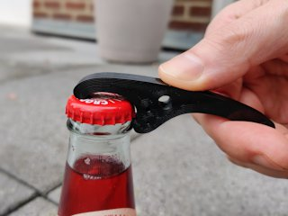
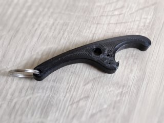

# Fully 3D Printed Compact Bottle Opener
*A small but robust keychain-compatible bottle opener that requires no metal inserts*

### License
[Creative Commons - Attribution - Share Alike](https://creativecommons.org/licenses/by-sa/4.0/)

### Gallery

[🔎](images/photo1.jpg) [🔎](images/photo2.jpg)

## Description and Instructions

Inspired by the classic but rather clunky [bottle opener by leemes](https://www.thingiverse.com/thing:132632/files) that does not rely on a metal insert like a coin, I have made my own model that is based on the same principle but with a more refined shape. Ready for use straight off the print bed!

When printed in a tough filament like PETG and when always ensuring that you have a good grip on the cap, this should last very long.

This opener will only cause minor deformation of the cap, allowing to re-seal the bottle (although you shouldn't expect an airtight seal anymore).

### Printing

You can print this in any material, but some are more suited for this application than others. The best material that can be easily printed is PETG, because it is tough and abrasion-resistant. Plain PLA may also work, but risks wearing out and also has a tendency to become brittle over time. A tough PLA variant would be preferred over regular PLA.

Recommended parameters:
* 0.2 mm layers;
* enough perimeters such that walls are more than 2 mm thick;
* a tough filament.

It is very important to print this with enough perimeters for maximum strength. The holes in the model are not just there for looks, they improve strength at the most important locations, but only when surrounded by a sufficient number of perimeters such that they touch each other. I printed this with **6 perimeters** of 0.4 mm width. If you print it this way, then infill in the rest of the model is not very important (I used a 30% honeycomb infill).

If you do want to print this 100% solid, then instead of using a 100% infill, it is better to just set the number of perimeters to 20 such that the print consists entirely of perimeters.
